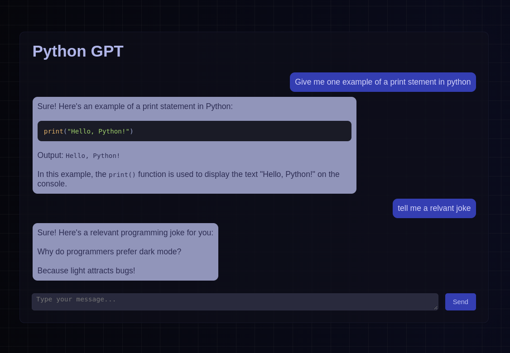

# FastGPT
*A FastAPI based version of GPT using asynchronous requests for improved performance*

FastGPT a high performance, customizable GPT chat application built with FastAPI and OpenAI's API. It implements several features essential to providing an excellent user experience, in addition to performance, and features a simple frontend UI built with HTML, CSS, and JavaScript
## Features
- 📝 Full conversation history functionality
- 🤖 Chat with the GPT-3.5 & GPT-4 models
- 🧰 Change system message in realtime from UI
- 💬 Real-time response character streaming functionality
- 🧩 Markdown support in both user and assistant messages
- 🎨 Syntax highligting for code blocks with automatic language detection
- ⚙️ Automatic scrolling with new messages, cancellable by scrolling up 


## Usage
```bash
git clone https://github.com/concaption/FastGPT.git
cd FastGPT
cp .env.example .env
# Edit .env file with your OpenAI API key
make setup
make run
```
or
```bash
git clone https://github.com/concaption/FastGPT.git
cd FastGPT
cp .env.example .env
# Edit .env file with your OpenAI API key
pip install -r requirements.txt
uvicorn app:app --reload
```
